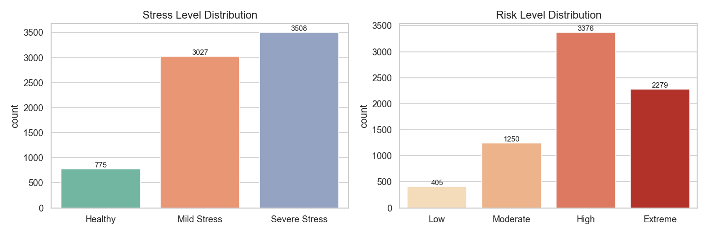
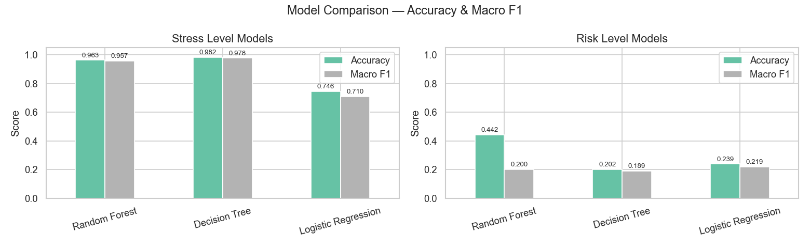
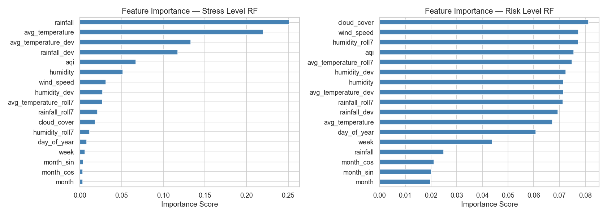
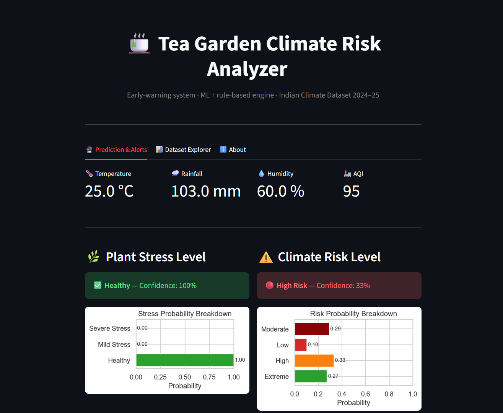
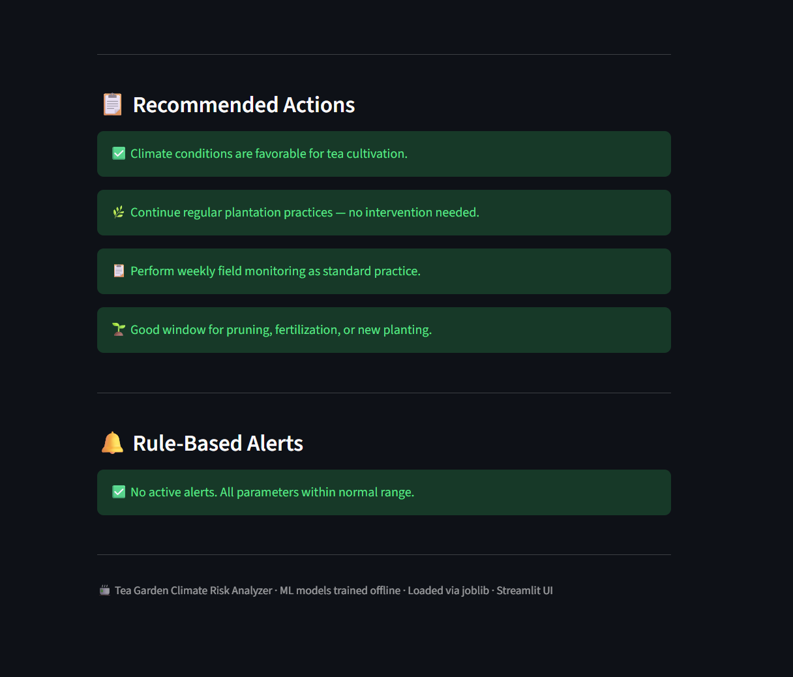
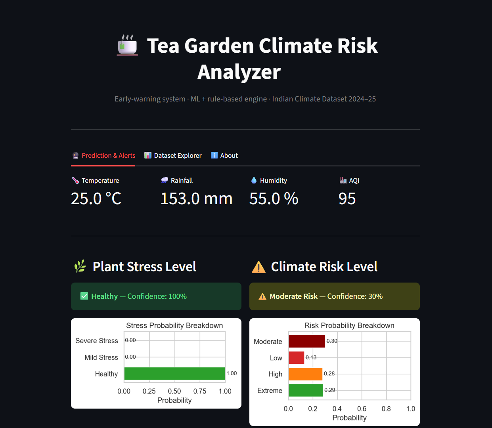
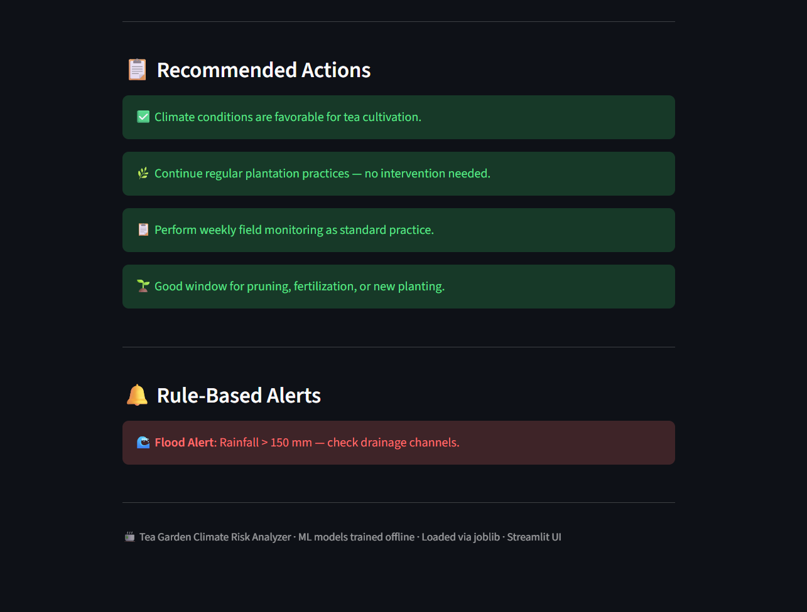
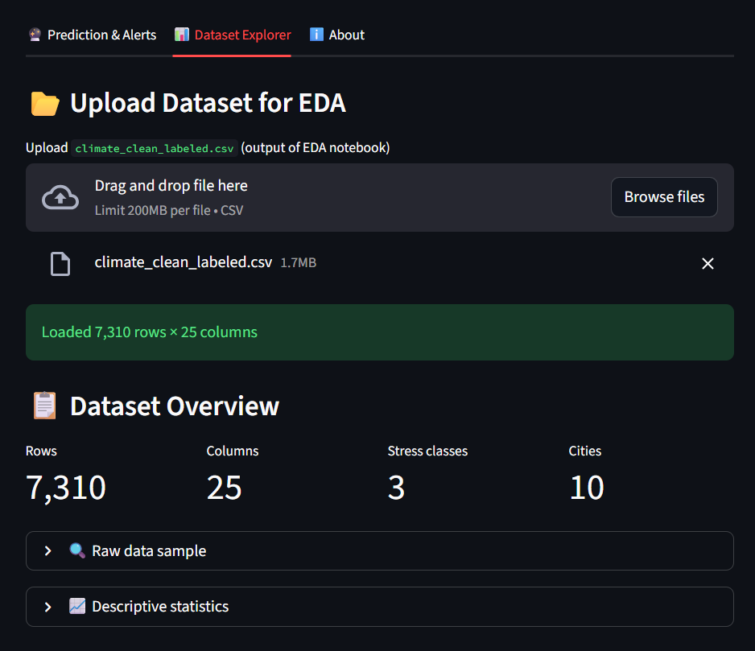
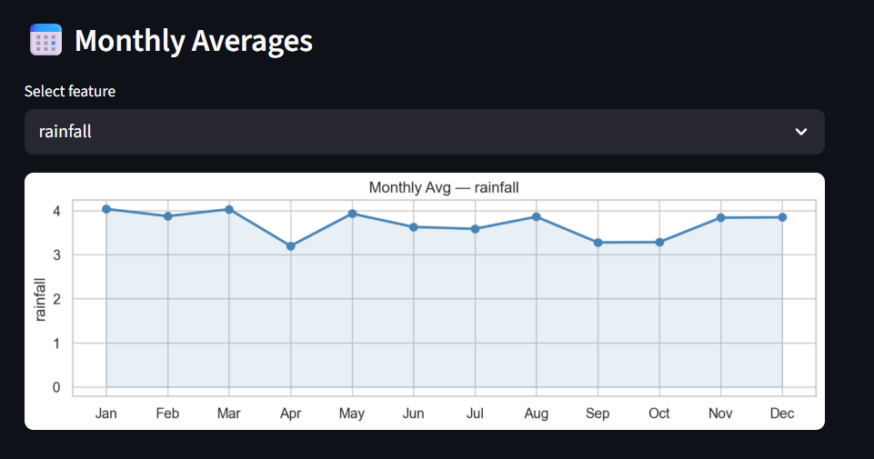
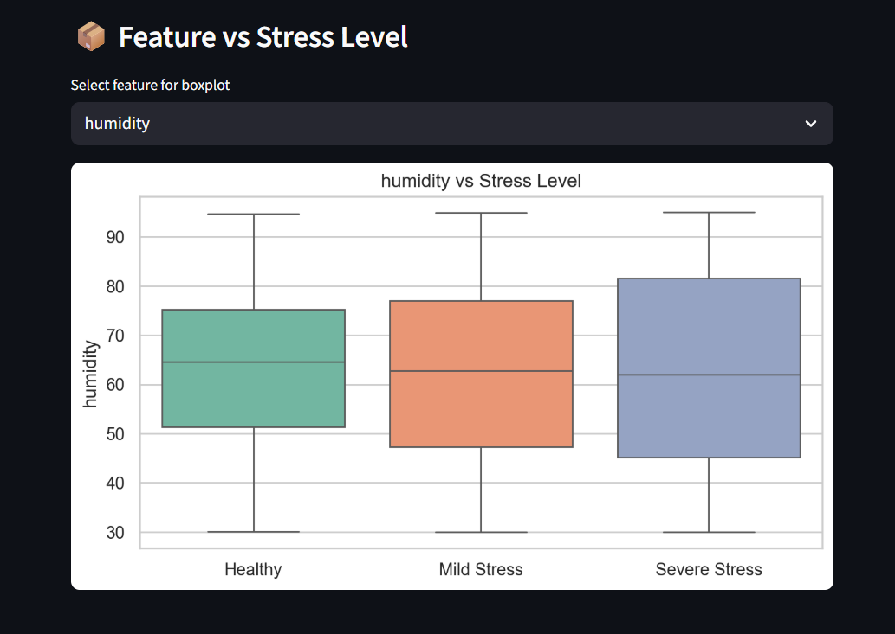

# Tea Garden Climate Risk Analyzer

<div align="center">

**A Machine Learning Approach to Tea Climate Stress and Risk Prediction**

*ML Hackathon Project | Computer Science Society, NIT Silchar*

</div>

## 🎯 Goal

The goal of this project is to build a lightweight, explainable prototype that uses historical climate data — temperature, rainfall, humidity, wind speed, cloud cover, and AQI — to **classify plant stress levels and climate risk** for tea gardens. It provides actionable early-warning alerts and agronomic recommendations to help farmers and garden managers make timely, data-driven decisions and minimize crop loss due to adverse weather conditions.

---

## 🧵 Dataset

**Source:** Kaggle — Indian Climate Dataset (2024–2025)  
**Link:** [https://www.kaggle.com/datasets/ankushnarwade/indian-climate-dataset-20242025](https://www.kaggle.com/datasets/ankushnarwade/indian-climate-dataset-20242025)

The dataset contains daily climate records across multiple Indian cities, including temperature, rainfall, humidity, wind speed, cloud cover, AQI, and geographical metadata (state, city) spanning 2024–2025.

---

## 🧾 Description

This project is built around a Streamlit-style workflow for climate analysis and model training: it ingests climate data, engineers stress-relevant features, and runs two parallel classifiers — one for **plant stress level** (Healthy / Mild Stress / Severe Stress) and one for **climate risk level** (Low / Moderate / High / Extreme). Labels are derived from a domain-informed **Climate Stress Index (CSI)** built from agronomic thresholds. The workflow is designed to support prediction breakdowns, rule-based alerts, and interactive exploration of feature distributions, correlations, and monthly trends.

---

## 📂 Folder Structure

```text
Tea-Climate-Analyzer/
├── Data/
│   ├── Indian_Climate_Dataset_2024_2025.csv
│   ├── climate_clean_labeled.csv
│   ├── raw_backup.csv
│   └── readme.md
├── Figures/
│   ├── 01_missing_values.png
│   ├── 02_label_distributions.png
│   ├── 03_boxplots_stress.png
│   ├── 04_correlation_heatmap.png
│   ├── 05_monthly_trends.png
│   ├── 06_csi_by_season.png
│   ├── 07_stress_confusion_matrices.png
│   ├── 08_risk_confusion_matrices.png
│   ├── 09_model_comparison.png
│   └── 10_feature_importances.png
├── Model/
│   ├── 01_eda_feature_eng.ipynb
│   └── 02_model_training.ipynb
├── LICENSE
├── README.md
└── requirements.txt
```

---

## 🧮 What I had done!

1. **Data Ingestion** — Loaded the raw Kaggle CSV; normalized column names; created a raw backup.
2. **Numeric Coercion & Renaming** — Converted all climate columns to float; renamed using keyword-based flexible mapping for robustness.
3. **Missing Value Handling** — City-wise median imputation with global median fallback; plotted missing-value percentages.
4. **Deduplication** — Removed exact duplicate rows.
5. **Outlier Capping** — Applied IQR-based Winsorisation (1.5× IQR fence) to all numeric features.
6. **Date & Season Engineering** — Parsed dates; extracted year, month, week, day-of-year; applied cyclical (sin/cos) month encoding; mapped months to Indian agricultural seasons (Winter / Summer / Monsoon / Post-Monsoon).
7. **Rolling Aggregates** — Computed per-city 7-day rolling means and deviations for temperature, rainfall, and humidity.
8. **CSI Label Creation** — Designed a scoring function (`compute_csi`) encoding tea-specific thresholds across all six climate variables; mapped scores to stress levels and risk levels.
9. **EDA** — Generated missing-value bar chart, label distribution bar charts, feature-vs-stress boxplots, correlation heatmap (lower triangle), monthly trend line charts, and seasonal violin plots.
10. **Model Training** — Trained three classifiers for each of the two tasks (stress and risk) with stratified 80/20 splits and 5-fold cross-validation.
11. **Evaluation** — Compared models by accuracy, macro F1, confusion matrices, and feature importance plots.
12. **Serialization** — Saved best models, label encoders, and feature list using `joblib`.
13. **Streamlit App** — Planned as a three-tab dashboard: Prediction & Alerts, Dataset Explorer, and About.

---

## 🚀 Models Implemented

| Model | Task | Why chosen |
|-------|------|-----------|
| **Random Forest Classifier** | Stress Level & Risk Level | Handles non-linear boundaries and class imbalance well via `class_weight="balanced"`; robust to noisy features; provides reliable feature importances. Primary production model. |
| **Decision Tree Classifier** | Stress Level & Risk Level | Fully interpretable — a printed tree can be shown to a non-technical agronomist. Serves as an explainable baseline; `max_depth=12` prevents overfit. |
| **Logistic Regression** | Stress Level & Risk Level | Fast linear baseline inside a `StandardScaler` pipeline; helps quantify whether the problem is linearly separable, establishing a lower-bound expectation. |

All models use `class_weight="balanced"` to compensate for label imbalance introduced by the CSI scoring distribution.

---

## 📚 Libraries Needed

- `pandas` — data loading, manipulation, and feature engineering
- `numpy` — numerical operations and cyclical encoding
- `scikit-learn` — model training, evaluation, preprocessing pipelines
- `matplotlib` — all static visualizations
- `seaborn` — statistical plots (heatmap, boxplot, violin, pairplot)
- `joblib` — model serialization and deserialization
- `streamlit` — interactive web dashboard
- `warnings` — suppress non-critical sklearn warnings

Install all dependencies:
```
pip install -r requirements.txt
```

---

## 📊 Visualization

### 🔥 Stress and Risk Level Distribution
<p align="center">
  
</p>

---

### 📈 Model Comparison
<p align="center">
  
</p>

---

### 💯 Feature Importance Score
<p align="center">
  
</p>

---

### 📸 Streamlit App Screenshots

#### 🔮 Prediction Dashboard(High Risk)
<p align="center">
  
</p>

#### 🔮 Prediction Dashboard(Moderate Risk)
<p align="center">
  
</p>

### 📈 Dataset Explorer
<p align="center">
  
</p>


---


## 📈 Comparison Table


### Stress Level Classification (3 classes: Healthy / Mild Stress / Severe Stress)

| Model | Accuracy | Macro F1 | 5-Fold CV Accuracy |
|-------|----------|----------|--------------------|
| Random Forest | 0.9631 | 0.9575 | 0.9458 ± 0.0107 |
| **Decision Tree 🏆** | 0.9822 | 0.9776 | 0.9752 ± 0.0031 |
| Logistic Regression | 0.7456 | 0.7096 | 0.7300 ± 0.0106 |

### Risk Level Classification (4 classes: Low / Moderate / High / Extreme)

| Model | Accuracy | Macro F1 | 5-Fold CV Accuracy |
|-------|----------|----------|--------------------|
| **Random Forest 🏆** | 0.4419 | 0.2004 | 0.4359 ± 0.0088 |
| Decision Tree | 0.2018 | 0.1887 | 0.2640 ± 0.0360 |
| Logistic Regression | 0.2387 | 0.2192 | 0.2238 ± 0.0151 |


---

## 📢 Conclusion

This project successfully combines climate data analysis, domain-informed feature engineering, and machine learning to build a practical tool for detecting tea-garden stress and risk. The pipeline transforms raw meteorological data into actionable insights, while the Climate Stress Index (CSI) improves label quality and makes the model outputs more meaningful for real-world agricultural decision-making.

The results show that the trained models, especially the Random Forest approach, are strong candidates for deployment in a lightweight dashboard. Beyond accuracy, the project emphasizes explainability, interpretability, and usability — all essential for supporting farmers, agronomists, and garden managers in making timely climate-related decisions.

Overall, this work demonstrates how a simple yet well-structured ML workflow can turn environmental observations into a useful early-warning system for tea cultivation.

---

## 🚀 Future Enhancements

To make the project even more impactful, the next steps can include:

- Integrating live weather APIs for real-time stress and risk prediction.
- Adding soil moisture, fertilizer, and pest data for richer agronomic insights.
- Deploying the dashboard as a web app with user-friendly alerts and recommendations.
- Improving model generalization using larger multi-region datasets and seasonal retraining.
- Adding explainability tools such as SHAP or feature-attribution visualizations for end users.

---

## ✒️ Author

Built as part of a climate-ML learning project using publicly available Indian climate data.

**3rd Semester Project**  
**Niladri Saikia |**
**Btech - Computer Science & Engineering |**
**NIT Silchar**